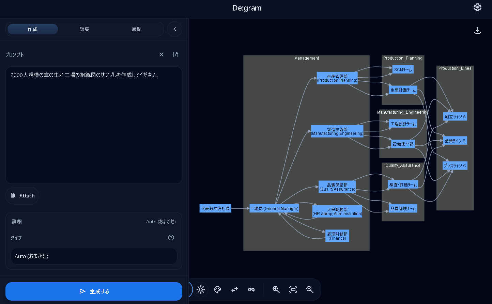
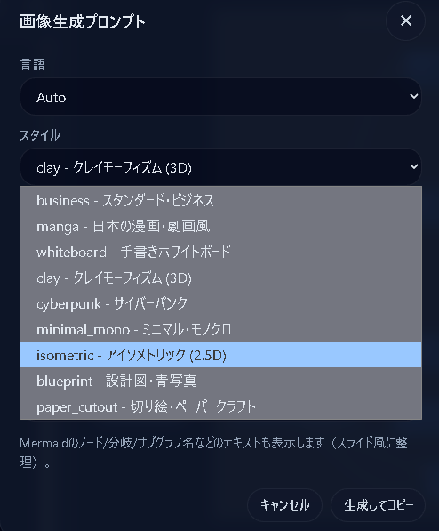
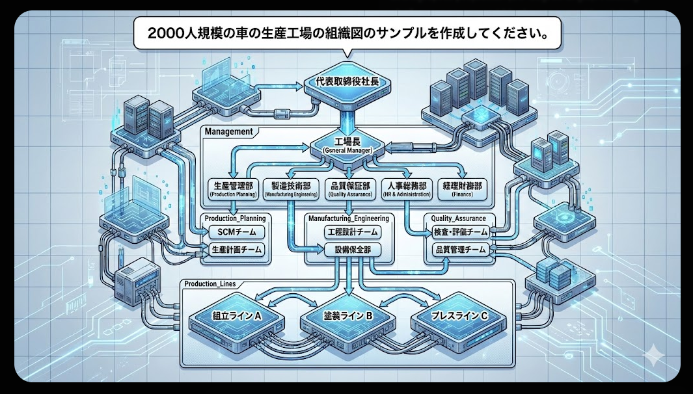

# De:gram (デグラム)

De:gramは、AI (Gemini) を活用してテキストや画像からMermaid.js形式の図解（ダイアグラム）を自動生成、編集、出力するためのGoogle Apps Script (GAS) アプリケーションです。



## 主な機能

- **AIによる図解生成**: 自然言語による説明や、画像ファイルの内容からMermaidコードを生成します。
- **Gemini Flash-lite 活用**: 最新の軽量・高速モデル gemini-flash-lite-latest を使用して、安定した生成を実現しています。
- **リアルタイム編集**: 生成されたMermaidコードをその場で修正し、プレビューに反映できます。
- **ビジュアル編集機能**: フローチャートなどの一部の図解では、SVG上の要素を直接クリックしてラベル編集やエッジの追加が可能です。
- **多彩なエクスポート**: ダイアグラムをPNG、SVG、またはAI生成による高品質な画像（ビジネス、漫画風、手書き風など）として出力。
- **履歴管理**: 過去に生成したダイアグラムを履歴として保存（ブラウザのローカルストレージおよびGoogleユーザプロパティを利用）。
- **マルチ言語対応**: UIおよびAIの出力（ラベル等）を日本語・英語で切り替え可能。

## インストール・セットアップ方法

このプロジェクトは Google Apps Script (clasp を使用) で構成されています。

### 必要なもの
- Google アカウント
- Node.js & npm (clasp 用)
- Gemini API キー ([Google AI Studio](https://aistudio.google.com/) で取得可能)

### セットアップ手順
1. **リポジトリのクローン**:
   ```bash
   git clone https://github.com/YOUR_USERNAME/degram.git
   cd degram
   ```

2. **clasp のインストールとログイン**:
   ```bash
   npm install -g @google/clasp
   clasp login
   ```

3. **新規 GAS プロジェクトの作成、または紐付け**:
   ```bash
   clasp create --title "De:gram" --type webapp
   ```
   (既存の `.clasp.json` を使用する場合は、`scriptId` を自身のプロジェクトのものに書き換えてください)

4. **コードのプッシュ**:
   ```bash
   clasp push
   ```

5. **スクリプトプロパティの設定**:
   - Google Apps Script のエディタ（ウェブ管理画面）を開きます。
   - 「設定（歯車アイコン）」→「スクリプトプロパティ」に移動します。
   - `GEMINI_API_KEY` という名前で、取得した API キーを保存します。

6. **デプロイ**:
   - 「デプロイ」→「新しいデプロイ」から「ウェブアプリ」を選択してデプロイします。
   - 発行された URL にアクセスして利用を開始します。

## 使い方
1. 左側の入力欄に、作成したい図の内容を日本語または英語で入力します。
2. 必要に応じて画像ファイルを添付します。
3. 「Generate」ボタンを押すと、AIがダイアグラムを生成します。
4. 右側のプレビューエリアで図を確認・調整し、必要に応じて「Download」から保存します。

## 生成例 (Generation Example)

### プロンプト入力と画像添付


### 生成されたダイアグラム


## 技術スタック
- **Frontend**: HTML5, Vanilla JavaScript, Tailwind CSS, Polyfill (Lucide Icons, Mermaid.js)
- **Backend**: Google Apps Script
- **AI Engine**: Google Gemini API (Vertex AI / Generative Language API)

## ライセンス
このプロジェクトは [MIT License](LICENSE) の下で公開されています。

## 免責事項
このアプリケーションは AI を使用してコードを生成するため、常に正確な図解が保証されるわけではありません。不正確な出力が含まれる可能性があることを理解して使用してください。
